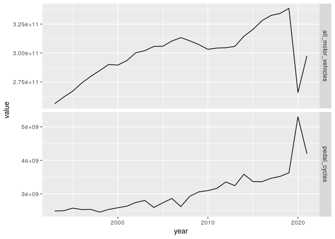

<!-- README.md is generated from README.Rmd. Please edit that file -->

# Historic cycling data

<!-- badges: start -->
<!-- badges: end -->

The goal of historic-cycling-data is to document available datasets on
changes in cycling over time in Great Britain. The focus is on changes
in recent years as part of the wider SATURN research project.

## DfT Manual Counts

test

DfT manual traffic count data is illustrated below.

<!-- -->
